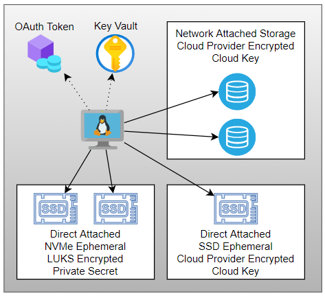
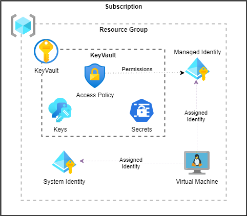
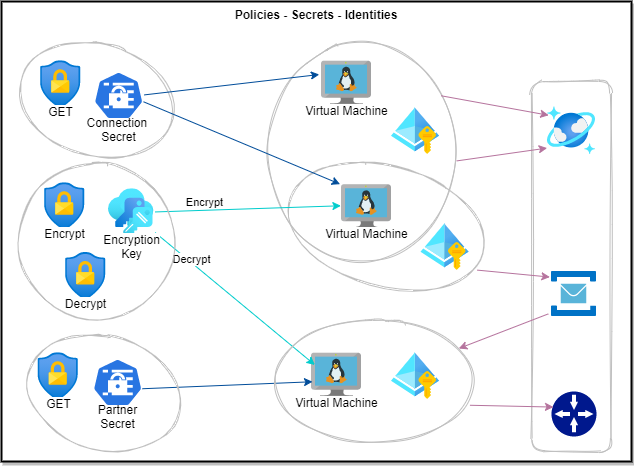
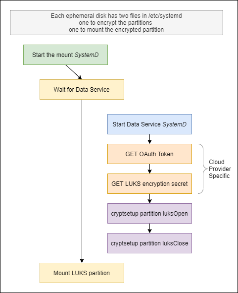

# Purpose
This project creates an Azure KeyVault Secret and then creates a VM and makes that secret visible to the VM.
* The entire process is scripted
* It creates a User Assigned identity and gives it access to the secret
* The VM must query for the secret with that identity

## WARNING
These scripts allocate LS_v2 machines by default because they have the local NVMe drives.  
LS_v2 machines are **expensive**. _tear down the VM_ when done using the provided scripts.
The Resource Group, KeyVault, Secrets and User Assigned Identity are cheap and don't cost much to retain.

You can create the Key Vault, Secrets and a VM using a cheaper VM without NVMe drives by changing the machine type in env.sh
This would be useful if you wanted to play with _Secrets_ and _Identities_ without the need of the NVMe drives.

Many different Azure VM types come with local storage.  That storage is automatically formatted and automounted.
They are not the VM types we are LUKS encrypting for document db usage.

## Disk Topology
Disk Optimized Virtual Machines have direct attached NVMe drives that are intended as storage devices
for document databases like Cassandra, MongoDB, ElasticSearch or others. It is up to to the 
provisioner to configure those drives.  In or case we will LUKS encrypt a partition on each local
ephemeral drive in order to implement "encryption at rest".



Many VM types have local ephemeral storage that is encrypted, formatted and mounted to be used as temp space.
They are not intended to be used as data drives by document stores.

## Azure Resource Topology
This example creates a Resource Group.
It then creates a Key Vault, a Secret, and an Identity.
That identity is given READ access to the secret via a policy in the KeyVault
The VM is assigned a system identity and the newly created identity.  
The VM uses the identity to retrieve the secret from the key vault by first acquiring an oauth token from the token server.
It presents that identity token to the keyvault when requesting the secrets.


## Using Secrets and Identities
_This section will eventually discuss how identities can be used for finer grain access controls across various computing resources_



## TODO
* All of this resource creation and customization **should** all be done with templates instead of scripts

## ISSUES
* The _Resource Group_ deletion script removes the KeyVault which have a default 90 day retention policy and cannot be re-created.

# Creating a Resource group, secretes and a VM
1. Install the Azure CLI.  
    * Ubuntu currently has the latest installed. So WSL2 developers running Ubuntu should be fine 
    * `az --version` should be 2.26.1 _or later_
1. Edit `env.sh` to set the resource names
1. Run scripts 0,1,2,3 to create resources.  The scripts are re-runable. 
    * `0-install-tools.sh` 
    * `1-login-az.sh`
    * `2-create-resources.sh`
    * `3-create-vm.sh` 
1. SSH onto the VM to verify
    * `ssh azureuser@<ip>` 
        * shown at the end of script `3-create-vm.sh`
    * Run `get-secret-via-uai-oath.sh` 
        * Verify the User Assigned Identity has been applied to the server and the secret is retirevable.

Provisioning Script Functions
| Script | Function |
| ------ | -------- | 
| 0-install-tools.sh | Install the Azure CLI |
| 0-install-tools.sh | Install jq |
| 1-login-az.sh      | Get azure login credentials. Only runs login if not logged in |
| 2-create-resources.sh | Create Resource Group | 
| 2-create-resources.sh | Create Key Vault | 
| 2-create-resoruces.sh | Create Secret to be used as LUKS encryption key |
| 2-create-resources.sh | Create User Assigned Identity |
| 3-create-vm.sh        | Create a VM |
| 3-create-vm.sh        | Associate system identity and previously created User Assigned Identity to it | 
| 3-create-vm.sh        | Create customized scripts that install and  maintain LUKS encrypted drives |
| 3-create-vm.sh        | Copy scripts to VM using SCP |
| 3-create-vm.sh        | Provide user ssh connection string |


# Luks encrypting the local disk
The actual LUKS encryption is done by scritps installed onto the virtual machine.
The scripts in `vm-files` are installed on the Virtual Machine.
They setup and enable LUKS encryption across all NVMe drives.
* `lunks-key.sh` is the only real Azure dependency. It is responsible for retrieving the LUKS encryption key from the KeyVault.


## Enabling encryption on a provisioned VM
| Command Line | Purpose |
| ------------ | ------- |
| `ssh azureuser@<ip>` | SSH into the vm per the output of `3.create-vm.sh` |
| `cd vm-tools` | tools are located here |
| `sudo bash command-line.sh` | Partition the NVM. Add the mount to the /etc |
| `lsblk` | verify the LUKS enabled on the NVMe |

## Encrypting and mounting the filesystem with systemd


## The file system after encryption
Standard_L16s_v2 with two ephemeral disks.
```
$ lsblk
NAME        MAJ:MIN RM  SIZE RO TYPE  MOUNTPOINT
loop0         7:0    0 99.4M  1 loop  /snap/core/11420
loop1         7:1    0  240K  1 loop  /snap/jq/6
sda           8:0    0   80G  0 disk
└─sda1        8:1    0   80G  0 part  /mnt
sdb           8:16   0   30G  0 disk
├─sdb1        8:17   0 29.9G  0 part  /
├─sdb14       8:30   0    4M  0 part
└─sdb15       8:31   0  106M  0 part  /boot/efi
sr0          11:0    1  628K  0 rom
nvme0n1     259:0    0  1.8T  0 disk
└─nvme0n1p1 259:1    0  1.8T  0 part
  └─data0   253:0    0  1.8T  0 crypt /data0
nvme1n1     259:0    0  1.8T  0 disk
└─nvme1n1p1 259:1    0  1.8T  0 part
  └─data1   253:0    0  1.8T  0 crypt /data1

```


# Destroying resources
Tear down the azure resources using these scripts. 
| Script | Function |
| ------ | -------- | 
| 8-destroy-vm.sh | to destroy the VM |
| 9-destroy-resource-group.sh | destroy the resource group. This will destroy the keyvault, the secret, the identity and the VM |

## References
* [Auto-mounting encrypted drives with a remote key on Linux at blue ink](https://withblue.ink/2020/01/19/auto-mounting-encrypted-drives-with-a-remote-key-on-linux.html)
* Files in vm-files originally from [Sean Brandt's Github](https://gist.github.com/seanb4t/fc244805aec83e55bfd1d306c19cd624)
* [Managing Identities at Azure Citadel](https://www.azurecitadel.com/vm/identity/)
* [Managed Azure identities tutorial by Microsoft](https://docs.microsoft.com/en-us/azure/active-directory/managed-identities-azure-resources/tutorial-windows-vm-access-nonaad)
* [Installing the Azure CLI by Microsoft](https://docs.microsoft.com/en-us/cli/azure/install-azure-cli-linux?pivots=apt)
* [managing the keyvault with the CLI by Microsoft](https://docs.microsoft.com/en-us/azure/key-vault/general/manage-with-cli2)
* [Azure CLI Examples by Microsoft](https://github.com/Azure-Samples/azure-cli-samples)

## Videos
* [Identities Secrets and Policies in Azure](https://youtu.be/HUW7_HvUBXE)
* [LUKS Encrypting Ephemeral Disks in Azure](https://youtu.be/S62dsa8d82E)
